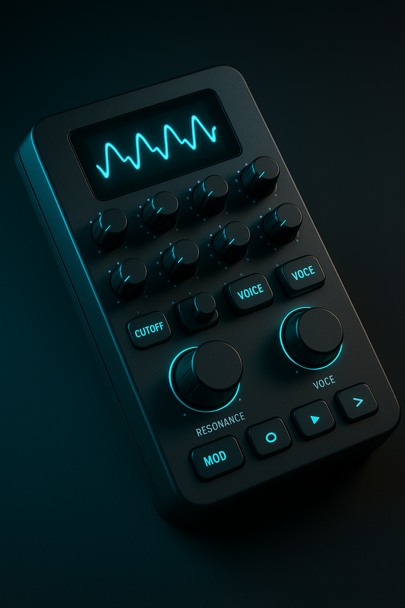

# ESP32-S3 Drone Synth

**Handheld West Coast-inspired experimental drone synthesizer** for sound exploration. Battery-powered, portable, with OLED visualization and soft-neon aesthetics.

## Hardware
- **ESP32-S3** + PCM5102A DAC (44.1 kHz stereo)
- **Display**: OLED/LCD for waveform visualization
- **Controls**: 10 pots, 2 encoders, 3 voice buttons + LEDs
- **Power**: Battery-powered portable design

## Sound Engine
- **3 polyphonic voices** with continuous frequency control (20–2000 Hz)
- **Wavefolding** for rich harmonic overtones
- **Filters**: Low-pass & high-pass (12 dB/oct)
- **Global LFOs**: Filter cutoff modulation, pitch vibrato
- **Effects**: Drive, delay, reverb

## Quick Start
- **Build**: `./scripts/build.sh`
- **Run**: `./scripts/run.sh`

See [DESIGN.md](docs/DESIGN.md) for full architecture and development roadmap.
